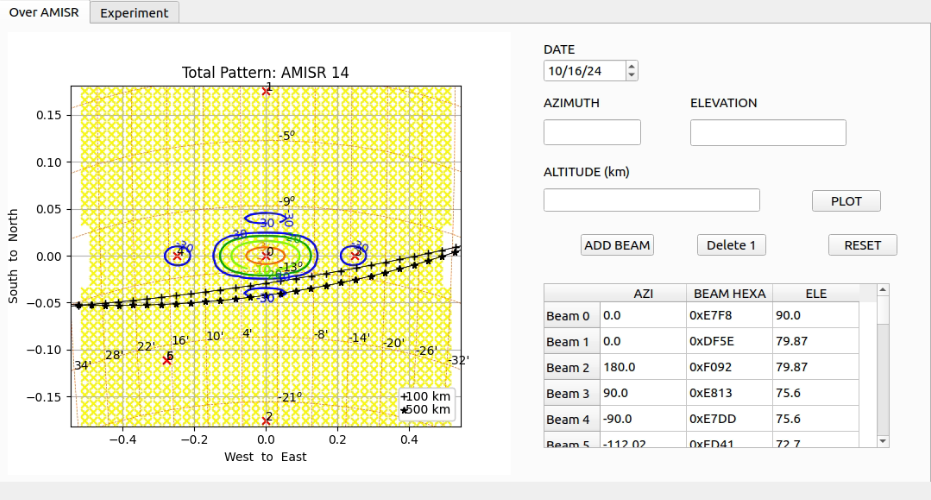

# **CONSIDERACIONES DE PROCESAMIENTO**

**Tabla de Configuracion de Apuntes:**

* V: Vertical
* N: Norte
* S: Sur
* E: Este
* O: Oeste

Podriamos considerar 0.238 porque el cos x e y  en N y S a 75° no se puede ver en la grafica.

|Apuntes  | V   | N      | S      | E      | O      | 
|---------|-----|--------|--------|--------|--------|
| Canales | Ch0 | Ch1   | Ch2   | Ch3   | Ch4   |
| Azimuth| 0      | 0      | 180    | 90     | -90 |     
| Elevación| 90  | 75.07  | 75.07  | 75.6  | 75.6 |      
| Cosx   | 0      | 0      | 0      | 0.246 | -0.246|      
| Cosy   | 0      | 0.246  | -0.246 | 0     | 0    |      

# **PATRON**

# **APUNTES Y PATRON EN GUI**

